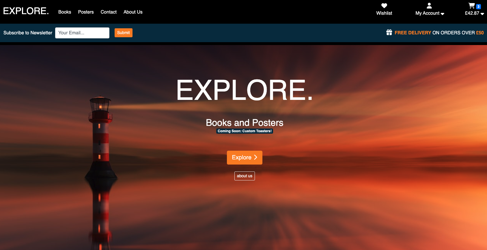

# Explore - Books, Posters and coming soon Custom Toasters

[View:  Live Project]()

## Overview

Explore is an online retail store operating on a business to customer strategy.  The store sells books and posters with scope for expansion into niche gifts.  The site is designed to be visually appealing and user friendly creating an environment that will retain a vistor attention and gain interest leading to retention, further interaction and sales.  

## Table of Contents
+ [User Stories](#user-stories)
    - [Developer Vision](#developer-vision)
    - [Customer Stories](#customer-stories)
    - [Owner Stories](#site-owner-stories)
+ [Planning and Development](#planning-and-development)
    - [Development Milestones](#development-milestones)
    - [Initial Wireframes](#initial-wireframes)
    - [Colour Scheme](#colour-scheme)
    - [Database Schema](#database-schema)
    - [Business Strategy](#business-strategy)
    - [Search Engine Optimisation](#seo)
+ [Features](#features)
    - [Navigation](#navigation)
    - [Homepage](#homepage)
    - [Products Page](#products-page)
    - [Product Detail](#product-detail)
    - [Basket](#basket)
    - [Checkout](#checkout)
    - [Profile](#profile)
    - [Accounts](#accounts)
    - [Contact](#contact--user-feedback-forms)
    - [Site Messages](#site-messages)
    - [Admin](#admin)
+ [Technologies](#technologies)
+ [Testing](#testing)
    - [Code Validation](#code-validation)
    - [Functionality Testing](#functionality-testing)
    - [Errors, Bugs, Issues](#issues)
+ [Improvements](#improvements)
+ [Deployment]()
+ [Credits]()
    -[Code](#code)
    -[Images](#images)
    -[Acknowledgements](#acknowledgements)

## User Stories
[Project Board](https://github.com/users/RadheyaM/projects/3/views/1) - for detailed user story progression and developer notes.

 

### Developer Vision

As a developer I want to design a site that is visusally attractive, with an intuitive interface leading to great overall user experience.  I want visitors to the site to like what they see and retain their attention.  It should be immediately clear how to navigate the site and find what you want.  The purpose of the site should be obvious, and clearly stated.  Colour should be used to indicate function, whether a button leads to information or performs a forward action.  Familiar navigation structures and layouts reduce the risk of frustrating visitors and provide comfort in intuitive action.

### Customer Stories

As a visitor to the site:

- I want to understand the purpose of the site so that I know if I can find what I'm looking for.
    - [landing page](#homepage)
- I want to find out more about the site and products on offer by browsing around.
    - [special feature](#homepage)
    - [about us](#about-us-page)
- I want to be able to browse through all the products to find what I'm looking for.
    - [products page](#products-page)
- I want to search or filter the products for a particular term to save time instead of scrolling.
    - [see products page feature](#products-page)
- I want the listed products to have good images and descriptions so that there is no doubt as to the quality of the product or what it is.
    - [see products page feature](#products-page)
- I want to see a summary of product details in the products page so that I don't need to click on every item to double check.
     - [product detail page](#product-detail)
- I want to see clearly how much a product costs.
     - listed on product page, product detail, basket aside, basket page and checkout.
- I want to be able to find out more about a product by a detail page at a click.
     - [product detail page](#product-detail)
- I want to be able to add an item to a wishlist so that I can come back later and find the item when ready to make a purchase.
    - [see wishlist feature in profile](#profile)
- I want to be able to add an item to my basket and still be able to continue browsing.
    - [basket aside feature](#navigation)
- I want to be able to check what is in my basket without leaving the page I'm currently on.
    - [basket aside feature](#navigation)
- I want to be able to see the cumulative cost of my basket items.
    - [basket page](#basket)
- I want to know how much I need to spend to get free delivery.
    - [basket aside feature](#navigation)
    - [basket page](#basket)
- I want to know about deals or ways to save money such as codes or sign-up offers.
    - [see navigation section](#navigation)
- I want to be able to remove items from my basket without deleting the whole basket.
    - [basket page](#basket)
- I want to be able to checkout securely, and be reasured that the checkout proceedure is secure.
    - [checkout page](#checkout)
- I want confirmation that my order has been processed successfully.
    - [checkout page](#checkout)
- I want to be able to find a history of my previous orders.
    - [profile order history section](#profile)
- I want to get in contact with site admin to ask a question or resolve an issue with the site or an order.
    - [contact page](#contact--user-feedback-forms)
- I want to be able to review the site and let other users/owners know if my experience has been good or bad.
    - [review site form](#contact--user-feedback-forms)
- If I like the site and products I want to recieve information on early deals, offers or new products in an email newsletter.
    - [banner, modal and footer forms](#navigation)
- I want to create an account to get the offer, or to use the wishlist functionality, or to see my previous orders or to save my address details.
    - [login or signup](#accounts)
- I want to be able to use my account and features, login and out, change my password, recover my password etc without encountering frustrating bugs or issues.
    - [login or signup](#accounts)
- When I perform an action on the site, such as add an item to my basket, I want clear and immediate feedback on my action so I don't have to double check.
    - [messages](#site-messages)

### Site Owner Stories

As an owner:

- I want to make sales, I want visitors to find my site, when they find it I want them to like what they see and stay on it for as long as possible.
- I want them to interact with the site and have a good experience as they do so.
- I want visitors to subscribe to my newsletter so that I can send them offers/advertisements and increase the likelyhood of making a sale.
- I want them to signup for an account to increase the likelyhood of their returning, and their feeling of investment in the site.
- I want to give a professional and safe feeling to the site so that visitors feel comfortable making purchases.
- I want to represent the community surrounding my products.
- I want to suggest similar products to what a customer is currently viewing to get add on sales.
- I want the customer to be able to get in touch and ask question, give feedback, to provide customer satisfaction.

## Planning and Development

### Development Milestones

- Create a basic site structure, home page, products page, navigation.
- Load products to the site.
- Implement essential functionality, basket, checkout, payment processing and confirmation.
- Improve structure and styling on the basic layout.
- Add extra features such as a wishlist, newsletter subscription, 10% offer on new account functionality.
- Optimise site navigation features.
- Add contact and about us pages.
- Implement search engine optimisation.
- Add community content, special features section to the homepage.
- Add responsive design so the site looks good and works well on all screen sizes.

### Initial Wireframes

[Wireframes]()

### Colour Scheme

### Database Schema

[Database Schema Excel Sheet](media/readme/resources/DB-Schema.xlsx)

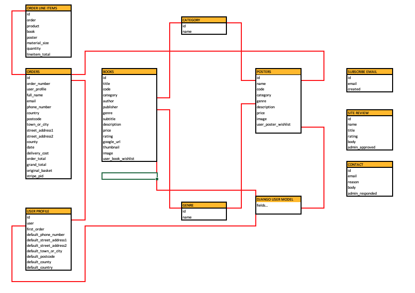
### Business Strategy
[Facebook Page]()

### SEO
- Keywords
- Meta Description
- Site Title
- Links
- 404 Error Page
- Robots.txt
- Sitemap.xml

## Features
<!--  -->

### Navigation

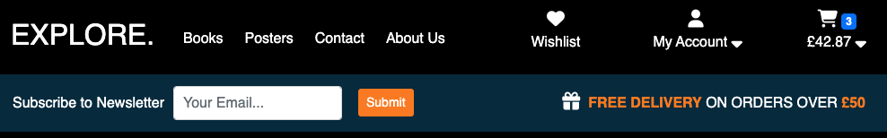

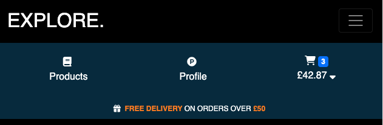

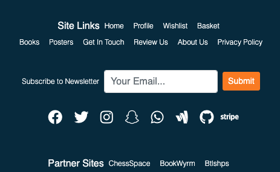

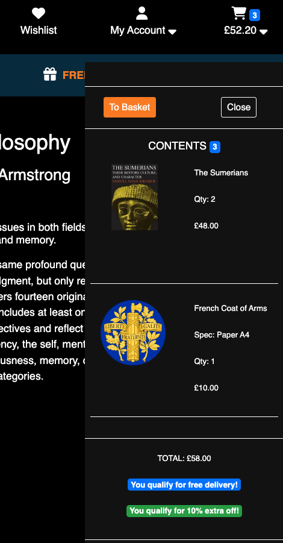

### Homepage

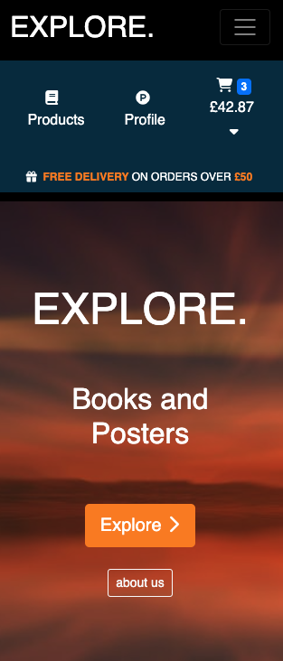

#### about us page

### Products Page

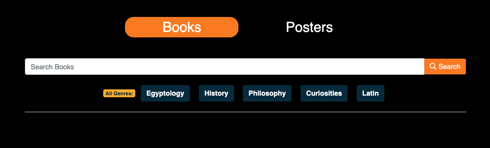

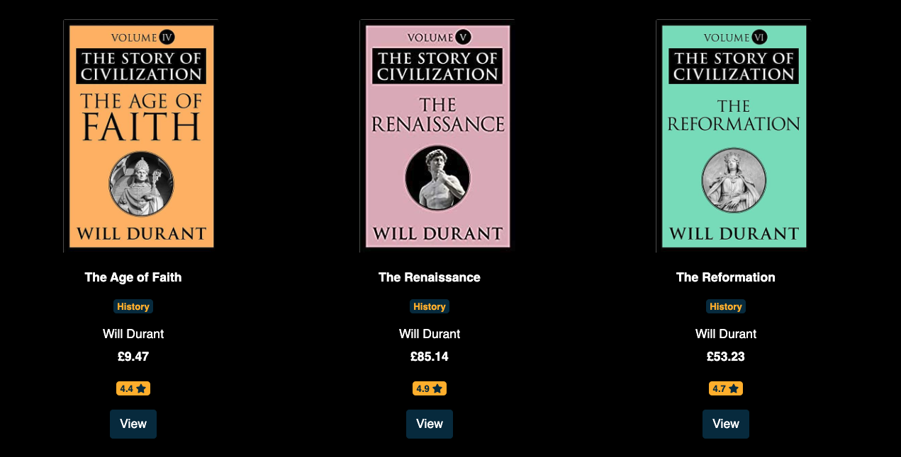

### Product Detail

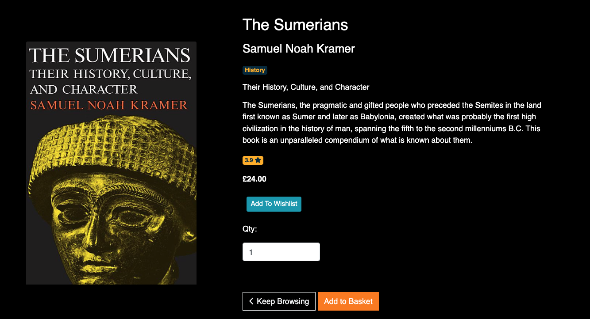

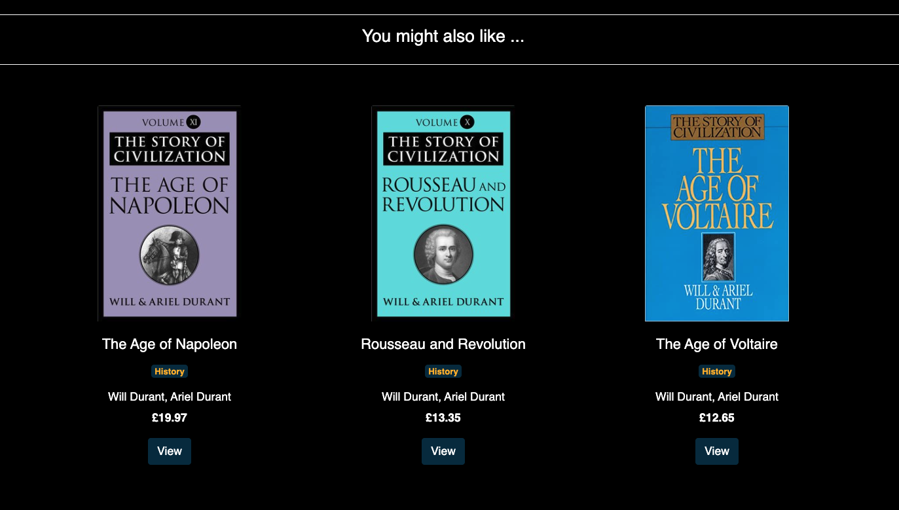

### Basket

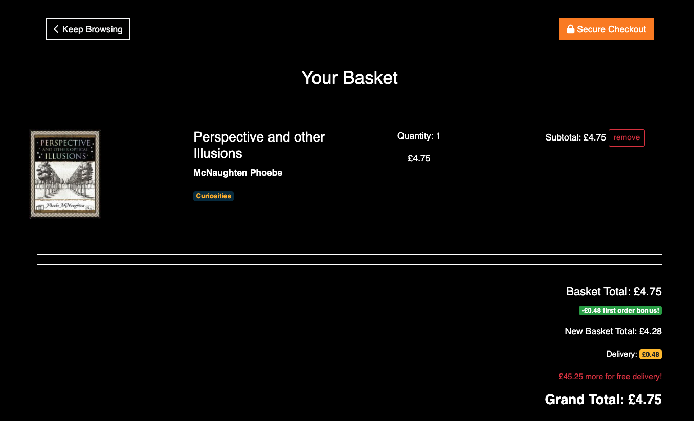

### Checkout

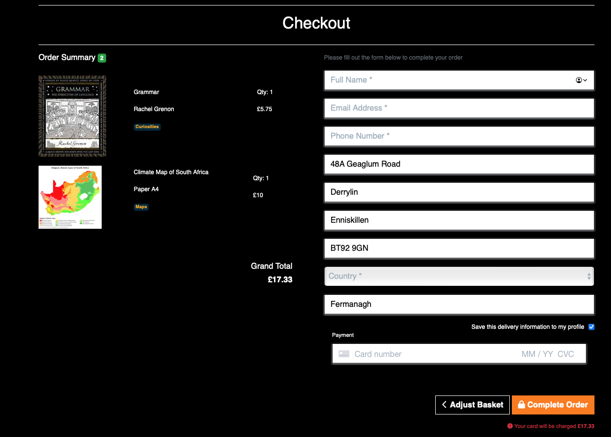

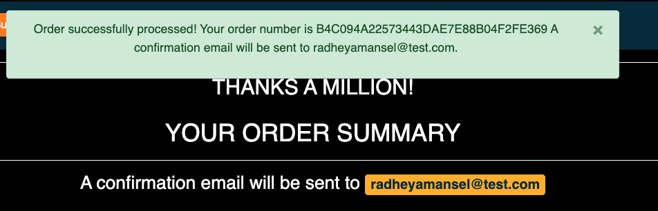
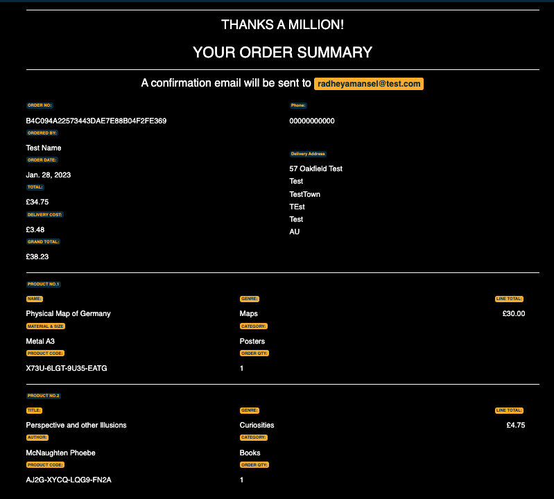

### Profile

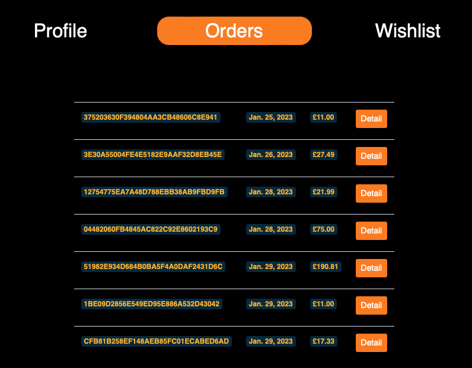

### Accounts

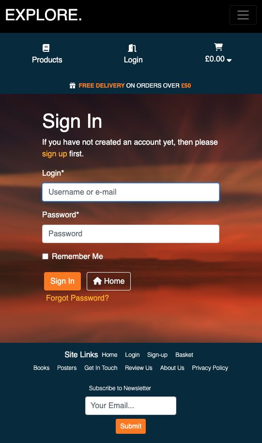

### Contact & User Feedback Forms

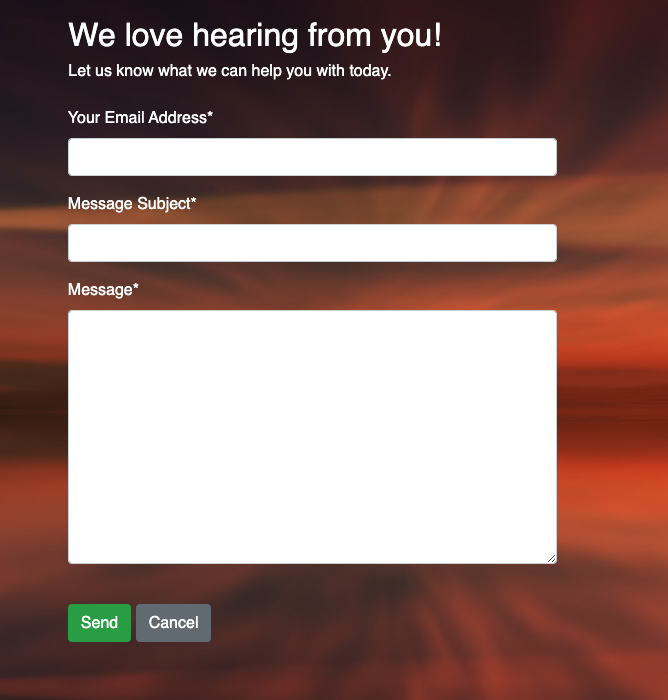

### Site Messages

### Admin

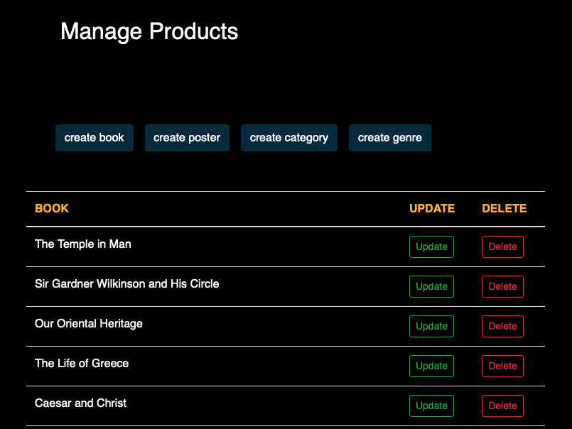

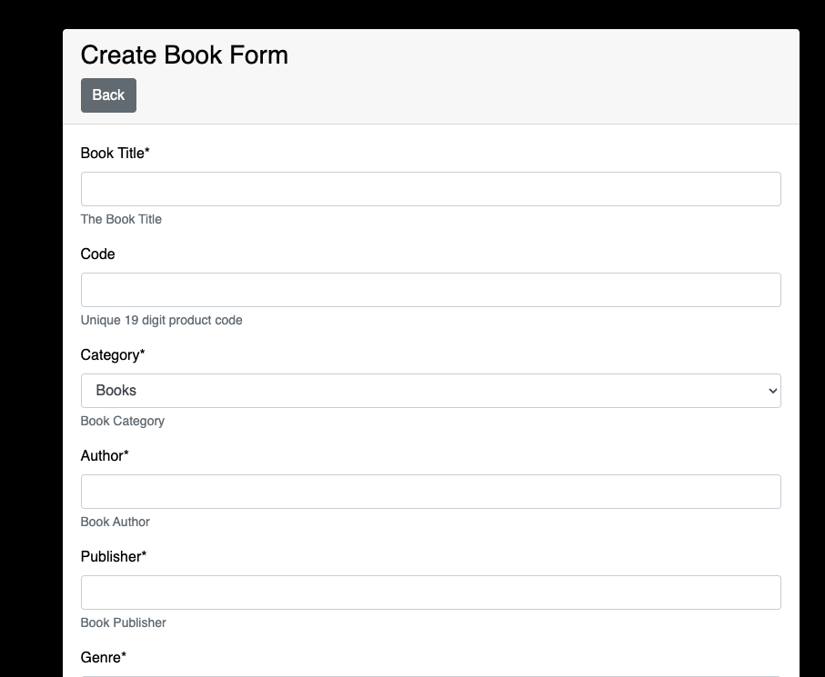

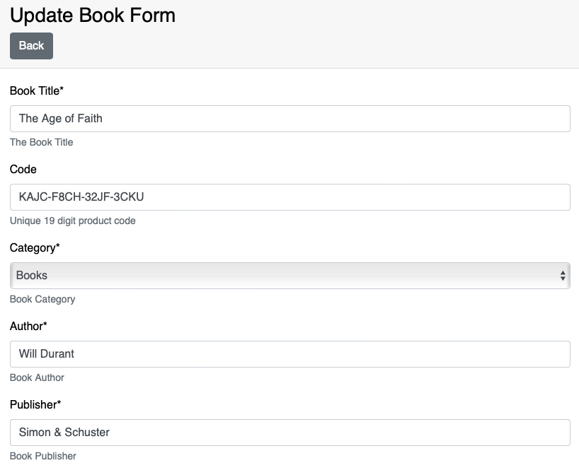

## Technologies
 - [Gidpod](https://www.gitpod.io/) - workspace
 - [Django version 3.2.16](https://docs.djangoproject.com/en/3.2/)
 - See [requirements.txt](requirements.txt) -for a full list of Django Add-on modules used.
 - Python 3.8.11
 - HTML5
 - CSS3
 - Javascript
 - [Bootstrap 4.6](https://getbootstrap.com/docs/4.6/getting-started/introduction/) -css module
 - [ElephantSQL](https://www.elephantsql.com) -Postgresql database service.
 - [Git](https://git-scm.com) -version control
 - [GitHub](https://github.com) -code repository
 - [Amazon Web Services](https://aws.amazon.com/) -static hosting
 - Deployed on [Heroku](https://devcenter.heroku.com)

## Testing
### Code Validation
### Functionality Testing
### Issues

## Improvements

## Deployment

## Credits
### Code
### Images
### Acknowledgements