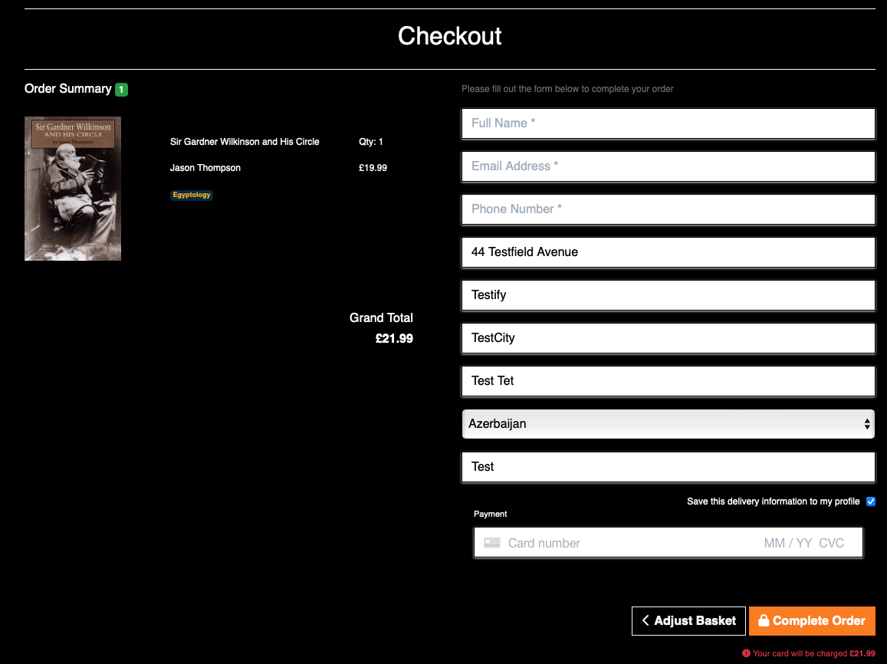
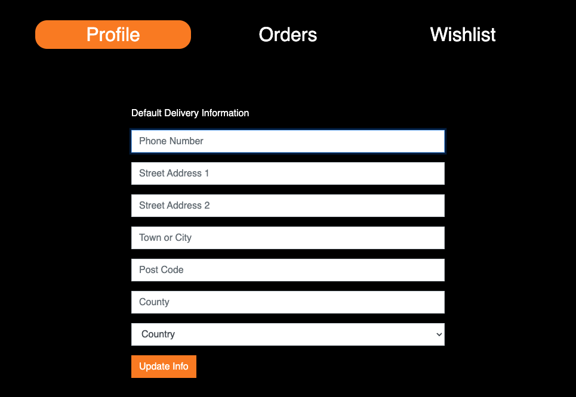

# Explore - Books, Posters and coming soon Custom Toasters

[View:  Live Project](https://explore-store.herokuapp.com)

## Overview

Explore is an online retail store operating on a business to customer strategy.  The store sells books and posters with scope for expansion into niche gifts. A user can browse products, add them to their basket and checkout.  They can also create an account to access extra features provided by the site.  The site is designed to be visually appealing and user friendly creating an environment that will retain a vistor attention and gain interest leading to retention, further interaction and sales.  

## Table of Contents
+ [User Stories](#user-stories)
    - [Developer Vision](#developer-vision)
    - [Customer Stories](#customer-stories)
    - [Owner Stories](#site-owner-stories)
+ [Planning and Development](#planning-and-development)
    - [Development Milestones](#development-milestones)
    - [Colour Scheme](#colour-scheme)
    - [Database Schema](#database-schema)
    - [Business Strategy](#business-strategy)
    - [Search Engine Optimisation](#seo)
+ [Features](#features)
    - [Navigation](#navigation)
    - [Homepage](#homepage)
    - [Products Page](#products-page)
    - [Product Detail](#product-detail)
    - [Basket](#basket)
    - [Checkout](#checkout)
    - [Profile](#profile)
    - [Accounts](#accounts)
    - [Admin](#admin)
    - [Contact](#contact--user-feedback-forms)
    - [Site Messages](#site-messages)
+ [Technologies](#technologies)
+ [Testing](#testing)
    - [Code Validation](#code-validation)
    - [Stripe Payment](#stripe-payment-tests)
    - [Django Admin Order Creation](#django-admin-order-creation)
    - [Account Email Confirmation](#email-verifictaion-for-account-setup)
    - [Devices and Browsers](#devices)
    - [Functionality Testing Indepth Report](#functionality-testing)
    - [Errors, Bugs, Issues](#issues)
+ [Improvements](#improvements)
+ [Deployment]()
+ [Credits]()
    -[Code](#code)
    -[Images](#images)
    -[Acknowledgements](#acknowledgements)

## User Stories
[Project Board](https://github.com/users/RadheyaM/projects/3/views/1) - for detailed user story progression and developer notes.

Comments have been made on the featured issues as progress was made.

 

### Developer Vision

As a developer I want to design a site that is visusally attractive, with an intuitive interface leading to great overall user experience.  I want visitors to the site to like what they see and retain their attention.  It should be immediately clear how to navigate the site and find what you want.  The purpose of the site should be obvious, and clearly stated.  Colour should be used to indicate function, whether a button leads to information or performs a forward action.  Familiar navigation structures and layouts reduce the risk of frustrating visitors and provide comfort in intuitive action.

### Customer Stories

As a visitor to the site:

- I want to understand the purpose of the site so that I know if I can find what I'm looking for.
    - [landing page](#homepage)
- I want to find out more about the site and products on offer by browsing around.
    - [special feature](#homepage)
    - [about us](#about-us-page)
- I want to be able to browse through all the products to find what I'm looking for.
    - [products page](#products-page)
- I want to search or filter the products for a particular term to save time instead of scrolling.
    - [see products page feature](#products-page)
- I want the listed products to have good images and descriptions so that there is no doubt as to the quality of the product or what it is.
    - [see products page feature](#products-page)
- I want to see a summary of product details in the products page so that I don't need to click on every item to double check.
     - [product detail page](#product-detail)
- I want to see clearly how much a product costs.
     - listed on product page, product detail, basket aside, basket page and checkout.
- I want to be able to find out more about a product by a detail page at a click.
     - [product detail page](#product-detail)
- I want to be able to add an item to a wishlist so that I can come back later and find the item when ready to make a purchase.
    - [see wishlist feature in profile](#profile)
- I want to be able to add an item to my basket and still be able to continue browsing.
    - [basket aside feature](#navigation)
- I want to be able to check what is in my basket without leaving the page I'm currently on.
    - [basket aside feature](#navigation)
- I want to be able to see the cumulative cost of my basket items.
    - [basket page](#basket)
- I want to know how much I need to spend to get free delivery.
    - [basket aside feature](#navigation)
    - [basket page](#basket)
- I want to know about deals or ways to save money such as codes or sign-up offers.
    - [see navigation section](#navigation)
- I want to be able to remove items from my basket without deleting the whole basket.
    - [basket page](#basket)
- I want to be able to checkout securely, and be reasured that the checkout proceedure is secure.
    - [checkout page](#checkout)
- I want confirmation that my order has been processed successfully.
    - [checkout page](#checkout)
- I want to be able to find a history of my previous orders.
    - [profile order history section](#profile)
- I want to get in contact with site admin to ask a question or resolve an issue with the site or an order.
    - [contact page](#contact--user-feedback-forms)
- I want to be able to review the site and let other users/owners know if my experience has been good or bad.
    - [review site form](#contact--user-feedback-forms)
- If I like the site and products I want to recieve information on early deals, offers or new products in an email newsletter.
    - [banner, modal and footer forms](#navigation)
- I want to create an account to get the offer, or to use the wishlist functionality, or to see my previous orders or to save my address details.
    - [login or signup](#accounts)
- I want to be able to use my account and features, login and out, change my password, recover my password etc without encountering frustrating bugs or issues.
    - [login or signup](#accounts)
- When I perform an action on the site, such as add an item to my basket, I want clear and immediate feedback on my action so I don't have to double check.
    - [messages](#site-messages)

### Site Owner Stories

As an owner:

- I want to make sales, I want visitors to find my site, when they find it I want them to like what they see and stay on it for as long as possible.
- I want them to interact with the site and have a good experience as they do so.
- I want visitors to subscribe to my newsletter so that I can send them offers/advertisements and increase the likelyhood of making a sale.
- I want them to signup for an account to increase the likelyhood of their returning, and their feeling of investment in the site.
- I want to give a professional and safe feeling to the site so that visitors feel comfortable making purchases.
- I want to represent the community surrounding my products.
- I want to suggest similar products to what a customer is currently viewing to get add on sales.
- I want the customer to be able to get in touch and ask question, give feedback, to provide customer satisfaction.

## Planning and Development

### Development Milestones

- Create a basic site structure, home page, products page, navigation.
- Load products to the site.
- Implement essential functionality, basket, checkout, payment processing and confirmation.
- Improve structure and styling on the basic layout.
- Add extra features such as a wishlist, newsletter subscription, 10% offer on new account functionality.
- Optimise site navigation features.
- Add contact and about us pages.
- Implement search engine optimisation.
- Add community content, special features section to the homepage.
- Add responsive design so the site looks good and works well on all screen sizes.

### Colour Scheme
[From Coolors](https://coolors.co/palettes/trending)

### Database Schema

[Database Schema Excel Sheet](media/readme/resources/DB-Schema.xlsx)

### Business Strategy

- Content is king and the site first and foremost needs to work, have good UI and IX and do what it promises to do well in order to gain and retain customers and increase market reach, any other business strategy must be built upon that foundation.
- Facebook is a great strategy for our type of business to build up a customer base and generate interest in and traffic to the site and increase marketing reach.
[Facebook Page Images](media/readme/images/facebook/)
- Newsletter Subscription - another strategy for our business model to build up customer contacts to send offers, new product info, adverts to increase interest and sales/market reach. [See navigation section for more](#navigation)

- Account creation 10% for signup incentive to increase engagement and potential sales.  Also might incentise a larger first time order to get more savings.

[see navigation section for more](#navigation)

- £50 free delivery is another incentive to increase sales and the offer is clearly advertised throughout the site.

### SEO
Seo practices used.
- Meta Keywords and use of keywords throughout the site.
- Meta Description tag.
- Site Title.
- Good link Pactice such as: 'rel=nooopener' link attributes on irrelevant links, links to well established sites, [see navigation feature section](#navigation)
- Descriptive 'alt' attributes in image tags.
- 404 Error Page

- [Robots.txt](robots.txt)
- [Sitemap.xml](sitemap.xml)

## Features
[All Feature Images](media/readme/images/)

### Navigation

Users can navigate the site in an intuitive manner.  The navigation adapts to screen size and on mobile the important Products, Account and Basket links do not go into the hamburger menu but are displayed below for better UI/UX.  Links for navigation also in the footer. There is a basket aside so the user can see what they have in their basket without having to leave the page they are currently on.  Orange is used to highlight action and important text.  The basket has an item counter badge. Links are responsive when moused over.

### Homepage

The landing page shows the purpose of the site clearly, there is a special feature section below for extra content and as an advertisement and below that are links to respected sites.

#### About Us

### Products Page

Products are displayed in uniform cards.  Picture and important information clearly visible.  User can search, filter and sort the items at the top of the page. If no search result returned an error message alert is given.  clicking on view or on the image leads to the product detail page.

### Product Detail

Product image and detail clearly displayed.  Add to wishlist, add to basket and keep browsing buttons prominantly displayed.  A 'you might also like' section below to recommend other products.

Logged in users can choose to add items to a wishlist, the button is responsive to the items current wishlist status, and an icon appears beside the title/name showing that it is in the wishlist.

### Basket

Products are clearly displayed with price, totals at the bottom.  Customers can choose to remove an item line from the basket using the clearly visible button.  Customers can choose to keep browsing or move to checkout.

### Checkout

Checkout also shows a summary of products and totals.  Profile info will be transferred from saved section of the Profile, if the user is logged in and entered that info beforehand.  From the checkout customers can choose to move back to edit their basket, or enter details in the validated form, enter payment information and complete the order.  They are then redirected to a success page with an order summary.

### Profile

The profile section has three pages which can be toggled with the buttons at the top.  The first page shows address info, the second shows order history and from there detail page can be viewd.  The third page contains a wishlist.

The wishlist has buttons to view product and remove.  Items are also automatically removed from the wishlist if that item is added to the basket, to keep the contents from getting bloated.

### Accounts

There are three user status', first is no account which can still make purchases.  Second is a user who has created an account, they will get a first order discount applied and will be able to use the profile functionality and save their address and order history. Third is the superuser who can access product management from a link in the navbar that the other users cannot see, this section allows for product CRUD functionality.  superuser also sees update and delete buttons on the product cards which normal users do not see.  superuser pages are protected by having no links display to normal users, and also with the permission required django service implemented in the code.

Navigation links adapt to user status, if you are logged in you only see links relevant to logging out or changing your password.  If you are logged out you only see login or signup links.  If you are a superuser you see extra admin functionality links and buttons.

### Admin

Without accessing django admin, the superuser can edit products in the product management section.  They can create, update or delete products.  They can read the products in the site as normal users can, or in the update form, I did not see the point of adding an extra detail view, this is something that could be easily implemented in a following increment.  Other database items can be accessed by the superuser in the django admin site.

### Contact & User Feedback Forms

Any user can leave feedback or get in touch with the two provided forms in the nav 'contact' dropdown menu.

### Site Messages

The site gives useful feedback to the user after every action in the form of alert messages that can be dismissed by clicking the &times button or just clicking the page for convenience.  

The site also uses badges to display basket count, and also in the basket aside to show the user how much more to spend for free delivery, if they qualify for free delivery and if they qualify for the 10% discount for new accounts.

### Error Handling
403 Forbidden Access, 404 Page not found and 500 Server Error custom handling pages have been designed and function appropriately.

## Technologies
 - [Gidpod](https://www.gitpod.io/) - workspace
 - [Django version 3.2.16](https://docs.djangoproject.com/en/3.2/)
 - See [requirements.txt](requirements.txt) -for a full list of Django Add-on modules used.
 - Python 3.8.11
 - HTML5
 - CSS3
 - Javascript
 - [Bootstrap 4.6](https://getbootstrap.com/docs/4.6/getting-started/introduction/) -css module
 - [ElephantSQL](https://www.elephantsql.com) -Postgresql database service.
 - [Git](https://git-scm.com) -version control
 - [GitHub](https://github.com) -code repository
 - [Amazon Web Services](https://aws.amazon.com/) -static hosting
 - Deployed on [Heroku](https://devcenter.heroku.com)

## Testing
### Code Validation

[Nu HTML Validation Reports](media/readme/resources/Nu%20Html%20Checker/)

#### One error with duplicate ID usage on the two subscription forms in the header and footer.  I have chosen to leave this as is for time reasons and as the two forms use the same view logic, but this would be a priority fix.  I don't see any problems arising from this in the form function.  As this is in the base.html file it shows up on all the test results.

[CSS Validation Reports](media/readme/resources/css%20validation/)
Everything passes.

[JSHint Results](media/readme/resources/jshint/)
All good.

Python validation was done using the gitpod linter and black formatter.

### Stripe Payment Tests

### Django Admin Order Creation

### Email Verifictaion for Account Setup

An email is sent out, the link works, confirmation page appears and on clicking the user is then able to login successfully.

### Devices

The site has been tested personally on a widescreen, a windows laptop, an ipad pro and a google pixel4.  Besides this google developer tools were used to test on many popular screen sizes for the best adaptability/reponsiveness possible

Google Chrome Version 108.0.5359.98 (Official Build) (arm64)

Safari Version 16.1 (18614.2.9.1.12)

Microsoft Edge Version 108.0.1462.46 (Official build) (arm64)

### Functionality Testing Indepth

[Testing Excel Sheet Source](media/readme/resources/Testing.xlsx)

### Issues

- Currently the save info to profile tickbox does not function.  Due to time considerations I was not able to fix this issue.
- Data from profile to checkout form mostly works although phone number, country and name do not come accross.
- There are a lot of components to this project, I have tested as extensively as I can but surely there are other bugs that have escaped my notice, however to the best of my knowledge the site functions as it should and looks good on most screen sizes.

## Improvements

### Code
- CSS and Bootstrap, I would improve the layout of the css files and which is used what HTML for ease of use and going over the code retrospect. I would not use as much bootstrap as I did, instead using custom CSS rather than the mixture that exists in the current code and makes editing more difficult.
- I would improve the way Poster and Product models work, to cut down on the duplication on the pages and view to accomodate both models with different fields.
- Add more SEO keywords throughout the site.

### Features
- Add a remove button to the basket aside.
- Add Admin functionality to respond to user messages, maybe have a dedicated message page for message threads.
- Add verified site reviews to the about us page.
- Add totals to the top and bottom of the basket and checkout pages when there are a lot of items and the page gets very tall.
- Allow users to adjust quantity in the basket instead of just deleting the whole line item.
- Improve the 'you might also like section' on the products detail page.
- Add product review functionality and display the reviews in the product detail page.

## Deployment

This site is deployed using Heroku combined with a Github repository updated from the IDE using Git. Once you have an Heroku account and have linked that with your Github account you can create a 'new' project by clicking that button in the top right corner, in the current version. Enter the name and regional information and in the next page click the 'Connect to Github' option and select the appropriate repository from your Github (or link the accounts and then do so, if not yet linked).

Enter the appropriate configuration variables in the settings tab of Heroku. If you do not know what to do here then find help for your specific case. Once the appropriate settings in Heroku match those in your repository you can navigate to the 'Deploy' tab of the Heroku dashboard.

The site uses AWS for static so an account needs to be set up.

Your database needs to be migrated from SQLite3 default to another service, such as ElephantSQL as this site uses.

Heroku can automatically deploy the selected Git branch of your respository when it is updated, or you can choose to manually update after each change, the choice is yours. Select your branch and click 'Deploy Branch'. Wait for the deployment to execute and then click 'View' to open your new app.

## Credits
### Code

Code Institute Project Boutique Ado was used to help with basket, checkout and intial general good practice and site design meta.  code used credited in code file comments.

Some code taken from W3schools credited in code file comments.

Kevin Powell Channel on Youtube helped with some CSS features credited in code.

### Images

- Product Images Books - Google Books (as I am not really selling books I don't see an issue arising with copyright, also they are available through the API).
- Product Images Posters - Wikipedia Free use.
- Mads Mikkelsen image can be used if it is credited Gage Skidmore on the page, with ref link, as it is.
- All other photos for site taken from [Pexels.com](https://www.pexels.com/)

### Acknowledgements
Thanks to Code Institute for the resources and my mentor Brian Macharia for his help.